# Islame App

## Description
Islame is a mobile application that provides users with access to all the chapters (Surahs) of the Quran, a selection of Hadith (sayings of the Prophet Muhammad), a digital Tasbeeh (prayer beads), and a radio feature. The app is available in both Arabic and English languages, and supports light and dark mode.

## Features
1. Quran: The app contains the full text of the Quran, allowing users to read and study the holy scripture.
2. Hadith: A curated collection of Hadith, providing users with the wisdom and teachings of the Prophet Muhammad.
3. Digital Tasbeeh: The app features a digital Tasbeeh, enabling users to perform the traditional practice of remembrance and glorification of Allah.
4. Radio: The app includes a built-in radio feature, allowing users to listen to Quran recitations and Islamic lectures.
5. Language Support: Islame is available in both Arabic and English languages, catering to a diverse user base.
6. Theming: The app supports both light and dark mode, providing a comfortable reading and listening experience for users.

## Technologies Used
- Flutter
- Dart
- flutter_localizations (for internationalization)
- provider (state management)

## Screenshots
### light mode
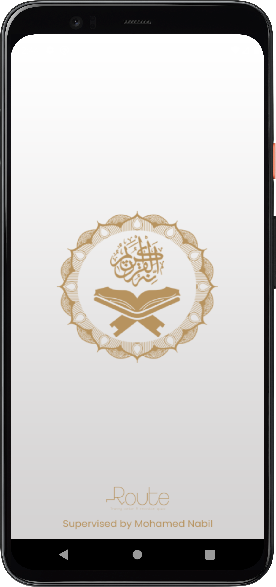  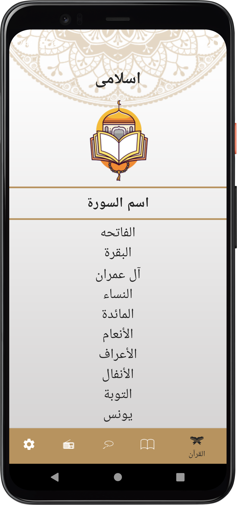 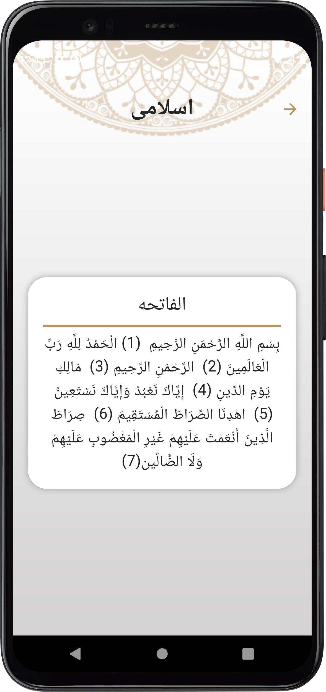 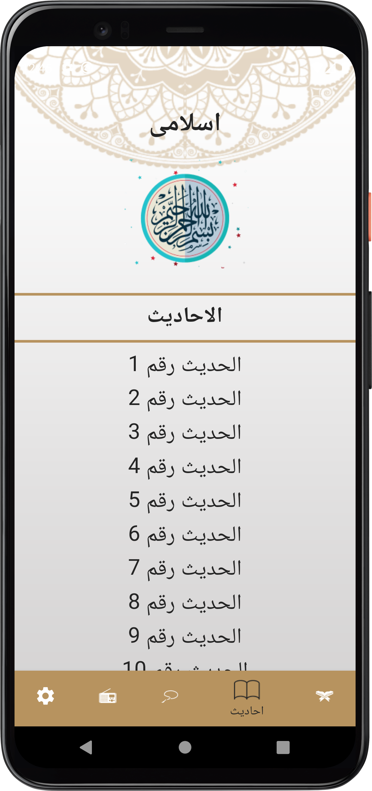  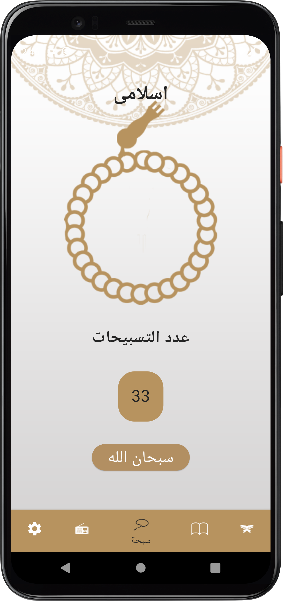  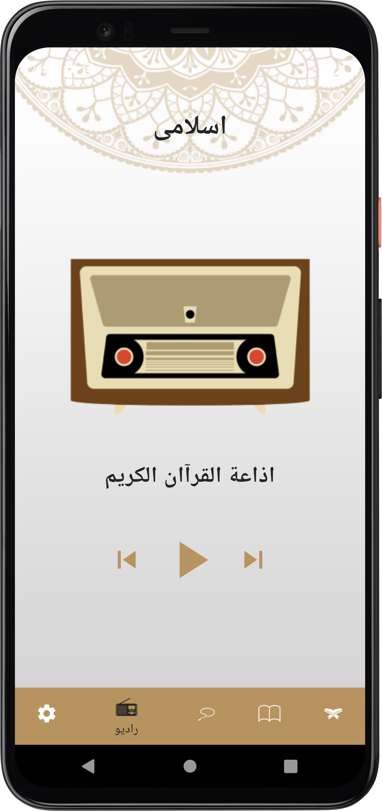 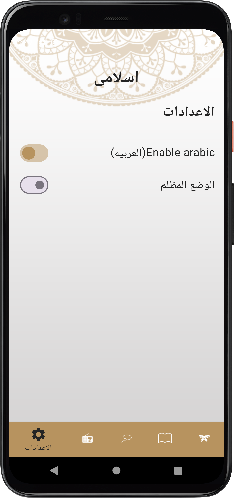

### dark mode
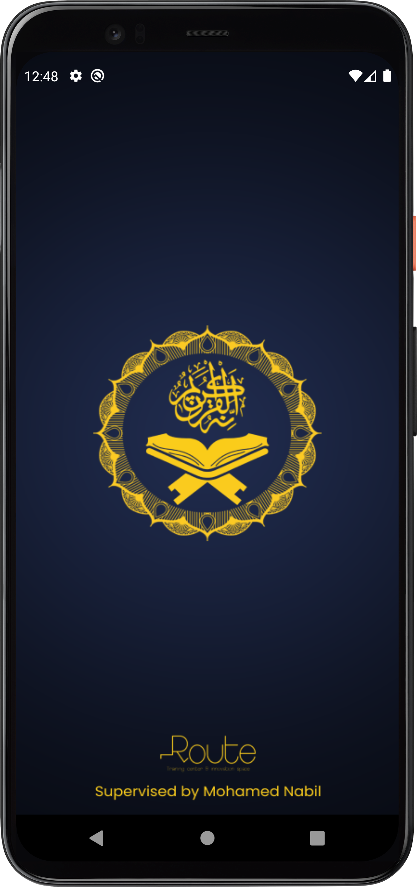 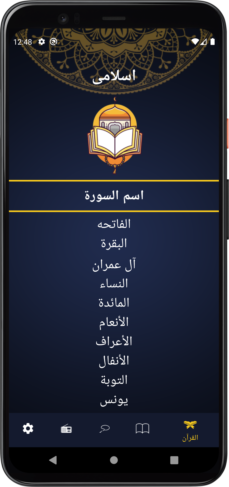    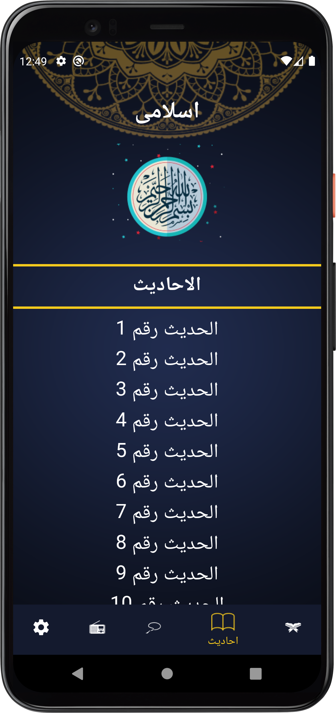  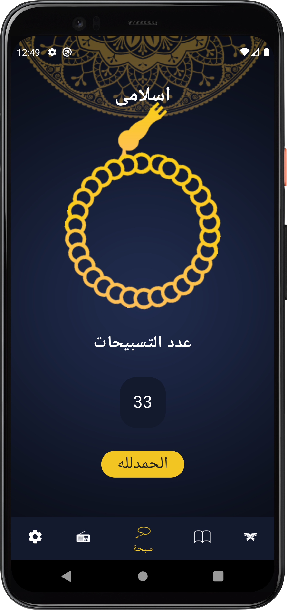  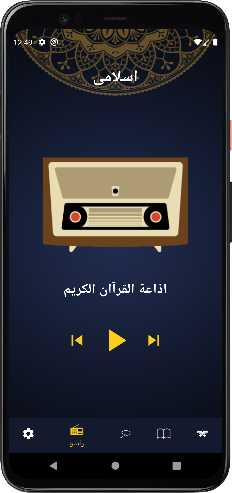 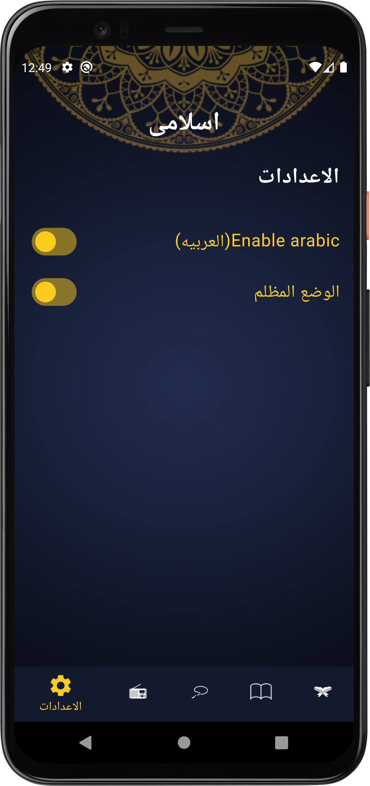

## Installation
1. Install the Flutter SDK
2. Clone the project repository
3. Install the project dependencies using flutter pub get
4. Run the app using flutter run

## Contributing
If you'd like to contribute to the Islame App project, please follow these guidelines:
1. Fork the repository.
2. Create a new branch for your feature or bug fix.
3. Make your changes and ensure the code passes all tests.
4. Submit a pull request with a detailed description of your changes.

## Contact
If you have any questions or feedback, please feel free to reach out to the project maintainers:
- Ahmed Mohsen : ahmedmohsen2492@gmail.com

